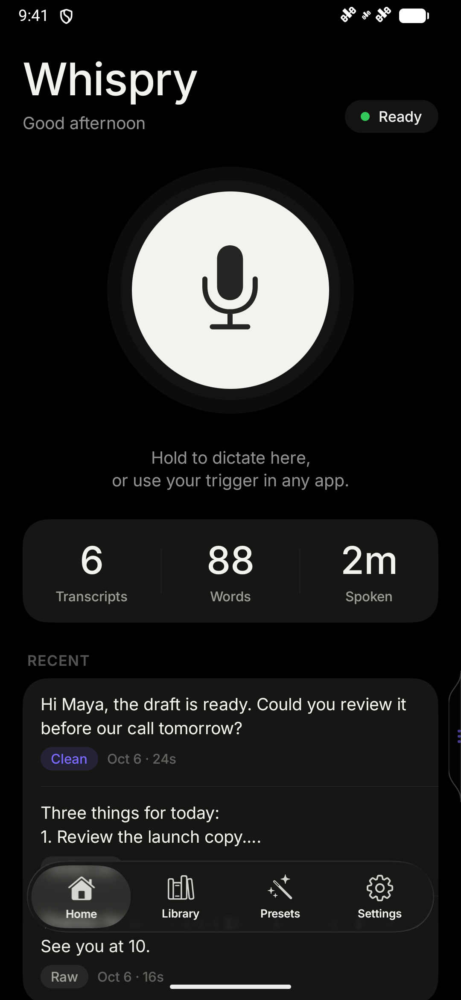
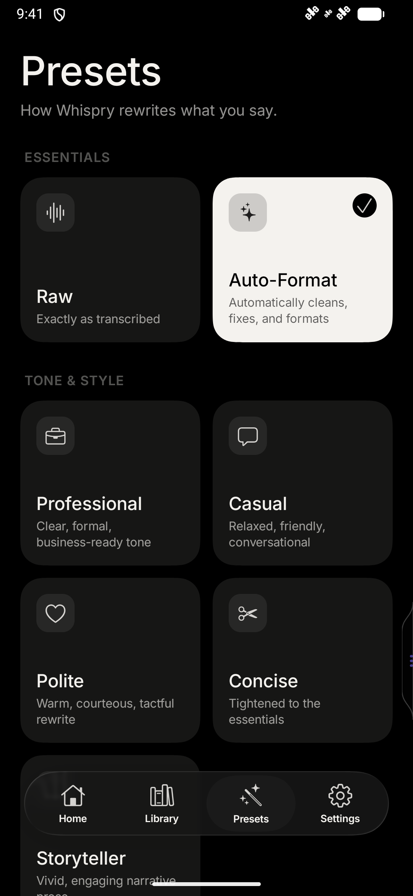
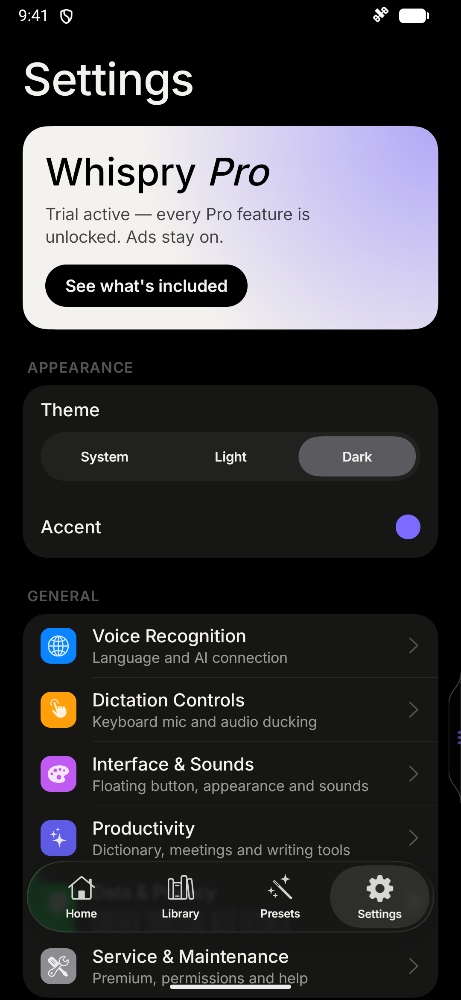

<h1 align="center">SF Symbols for Jetpack Compose</h1>

<p align="center">
  All 7,007 Apple SF Symbols as native <code>ImageVector</code>s for Android and Compose Multiplatform.
</p>

<p align="center">
  <a href="LICENSE"></a>
  <a href="https://kotlinlang.org"></a>
  <a href="https://developer.android.com/jetpack/compose"></a>
  <a href="https://developer.apple.com/sf-symbols/"></a>
  <a href="https://jitpack.io/#cosmictaserdev-creator/Jetpack_SF_Symbols"></a>
</p>

<p align="center">
  <a href="#install">Install</a> &nbsp;&middot;&nbsp;
  <a href="#use">Use</a> &nbsp;&middot;&nbsp;
  <a href="#find-a-symbol">Find a symbol</a> &nbsp;&middot;&nbsp;
  <a href="USAGE.md">Full guide</a>
</p>

<br>

<table>
  <tr>
    <td width="33%"></td>
    <td width="33%"></td>
    <td width="33%"></td>
  </tr>
</table>

<p align="center"><sub>Whispry, a voice dictation app for Android, built with SF Symbols for Compose.</sub></p>

## Why this library

**Every symbol.** The full SF Symbols 7 set, 7,007 symbols, each in a Dualtone and a Monochrome version.

**Feels like Material Icons.** Same shape of API as `Icons.Filled.Home`, so autocomplete just works: `SfSymbols.Dualtone.SFHouseFill`.

**Costs nothing you do not use.** Icons are built lazily on first use, and R8 removes every symbol your code never references.

**Runs everywhere Compose runs.** Android (minSdk 21), Desktop, iOS and Web.

## Install

**1. Add JitPack** to `settings.gradle.kts`:

```kotlin
dependencyResolutionManagement {
    repositories {
        google()
        mavenCentral()
        maven("https://jitpack.io")
    }
}
```

**2. Add the dependency** to your app module's `build.gradle.kts`:

```kotlin
dependencies {
    implementation("com.github.cosmictaserdev-creator:Jetpack_SF_Symbols:1.0.4")
}
```

**3. Sync Gradle.** That is it.

Prefer to vendor the source or use a composite build? See [INSTALLATION.md](INSTALLATION.md).

## Use

Pass a symbol to the regular Compose `Icon`:

```kotlin
import com.composables.sfsymbols.SfSymbols
import com.composables.sfsymbols.dualtone.SFHeartFill

Icon(
    imageVector = SfSymbols.Dualtone.SFHeartFill,
    contentDescription = "Favorite",
    tint = Color(0xFFFF375F),
    modifier = Modifier.size(28.dp)
)
```

Size it with `Modifier.size`, color it with `tint`. Nothing else to learn.

### Dualtone or Monochrome

Every symbol comes in two styles. Pick one by changing the package.

| Style | Import from | Looks like |
| :--- | :--- | :--- |
| Dualtone | `com.composables.sfsymbols.dualtone` | Two layers of the same tint at different opacity. Closest to Apple's hierarchical style. |
| Monochrome | `com.composables.sfsymbols.monochrome` | One solid shape. Best for small sizes and toolbars. |

```kotlin
import com.composables.sfsymbols.monochrome.SFFolderFill

Icon(SfSymbols.Monochrome.SFFolderFill, contentDescription = "Folder")
```

## Find a symbol

**Turn the Apple name into the Kotlin name.** Drop the dots, capitalize each word, add `SF` in front.

| Apple name | Kotlin name |
| :--- | :--- |
| `heart.fill` | `SFHeartFill` |
| `square.and.arrow.up` | `SFSquareAndArrowUp` |
| `figure.outdoor.cycle` | `SFFigureOutdoorCycle` |
| `battery.100percent` | `SFBattery100percent` |

**Browse visually.** Search the [SF Symbols app](https://developer.apple.com/sf-symbols/) on a Mac, then convert the name with the rule above.

**Search at runtime.** `SfSymbolsCatalog` lets you build your own icon picker:

```kotlin
import com.composables.sfsymbols.SfSymbolsCatalog

SfSymbolsCatalog.search("wifi")                          // every symbol matching "wifi"
SfSymbolsCatalog.findByAppleName("square.and.arrow.up")  // name, categories, restriction flag
```

## More docs

* [INSTALLATION.md](INSTALLATION.md) covers local modules, composite builds and R8.
* [USAGE.md](USAGE.md) covers Material 3 buttons, navigation bars, custom Canvas drawing and Multiplatform.

## Support

If this saves you time, you can support the work on [Ko-fi](https://ko-fi.com/cosmictaser), say hi on [Discord](https://discord.gg/Ejeb4cmzfd), or visit [cosmictaser.de5.net](https://cosmictaser.de5.net).

## Credits and license

Built on [`sf-symbols-lib`](https://github.com/phranck/sf-symbols-lib) by [phranck](https://github.com/phranck) and [sf-symbols-lib-jetpackCompose](https://github.com/cosmictaserdev-creator/sf-symbols-lib-jetpackCompose).

The generator and Kotlin bindings are released under the [MIT License](LICENSE). The symbol artwork belongs to Apple Inc. and SF Symbols is an Apple trademark. Read Apple's [SF Symbols license](https://developer.apple.com/sf-symbols/) before shipping these icons in a product, since it limits their use outside Apple platforms. This project is meant for education, interoperability and design research.
